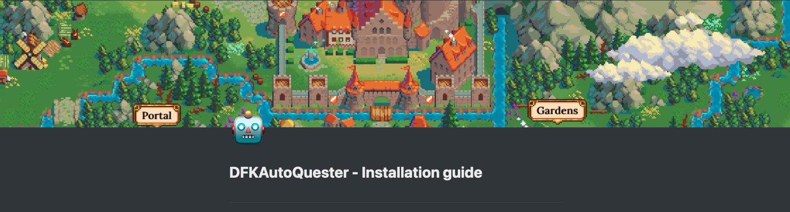
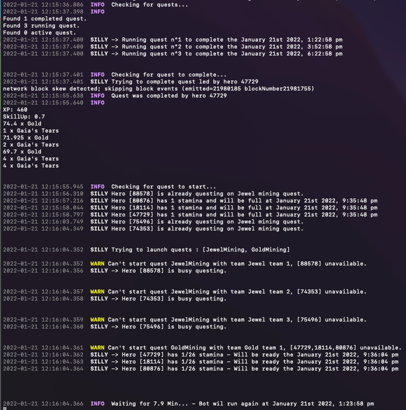

# DeFi Kingdoms Auto quester for Serendale
Full automatic quester for the DeFi game called Defi-Kingdoms 

OUTDATED - Use it as a template or inspiration for your own thing

## Information

I made a big pdf under `pdf/DFKAutoQuester-Installation_guide` that explains everything you need to know about the bot (installation & setup).

## Features

This bot is written in typescrip, it connects to the DeFi Kingdom serendale blockchain contract via RPC, it will then start to quest automatically based on a configuration you made.

The bot will report everything he did on a private telegram channel (see pdf for how to setup).

It includes :
- Automatic questing (start, complete), all profession
- Fully configurable 
- Automatic fallback to other RPC if too much errors
- Telegram command 

## Disclaimer

This was written when DFK was as his peak and I don't even know if the Serendale RPC are still working since they are switching blockchain

You can use this project as an example or inspiration for the Crystalvale kingdom.

As always, downloading and using the bot is at your own risk, you take full responsabilities and if you lose money it's your own fault.

Catch me on [Twitter](https://twitter.com/crypto_nawwa/) for any question 